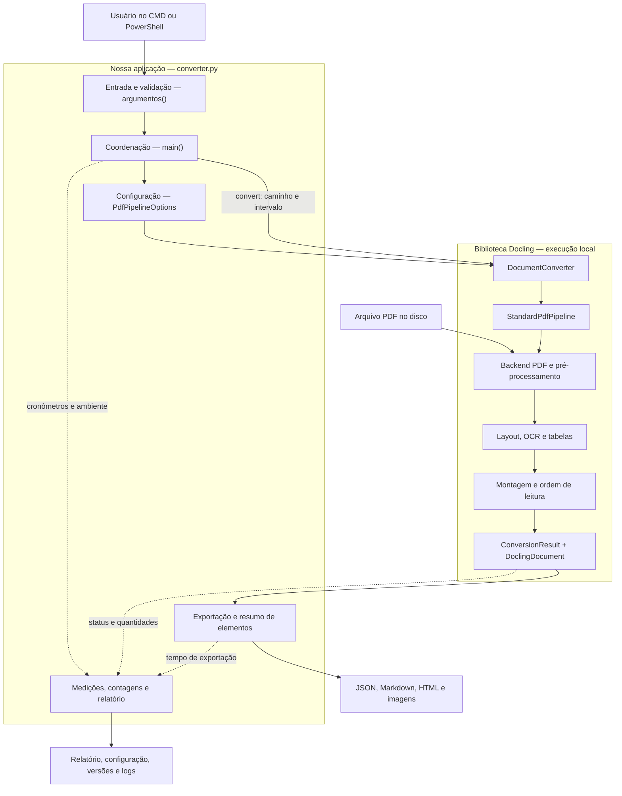
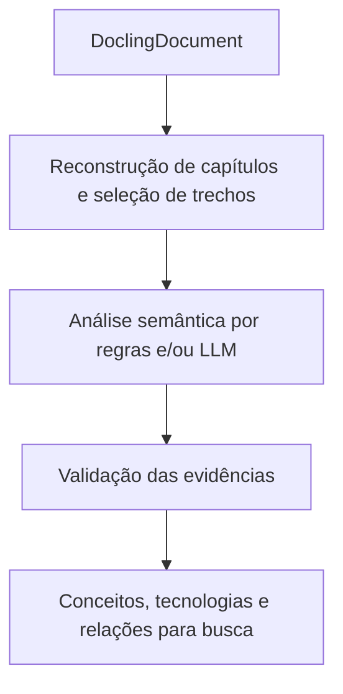

# Arquitetura do experimento de conversão de TCCs com Docling

Este documento descreve as responsabilidades, conexões e fronteiras do programa implementado em [converter.py](converter.py), desde a entrada do PDF até a exportação do documento e do relatório de desempenho.

O programa é uma aplicação de linha de comando. Ele coordena a conversão documental, exporta os resultados e registra métricas. A configuração atual utiliza modelos especializados em layout, OCR e tabelas. **Não há uma chamada ativa a uma LLM para interpretar o TCC ou escrever o relatório de desempenho.**

As referências à implementação interna do Docling correspondem à versão **2.130.0**, registrada no ambiente e na execução examinada. Esses detalhes podem mudar com atualizações.

## 1. Visão geral e distribuição de responsabilidades

A implementação própria está concentrada em `converter.py`. Há camadas lógicas, mas elas ainda não estão separadas em módulos independentes: grande parte das operações está dentro de `main()`.



As conexões entre o script e o Docling são chamadas de funções e objetos Python em memória. A arquitetura atual não utiliza servidor HTTP intermediário, API REST ou banco de dados.

| Responsável | O que decide ou executa |
|---|---|
| Nosso programa | Qual arquivo processar, quais opções usar, onde salvar e o que medir |
| Docling | Como ler o PDF, executar os modelos e montar a representação documental |
| Modelos especializados | Previsões de layout, caracteres e estrutura de tabelas |
| Sistema de arquivos | Armazenamento do PDF, modelos em cache e resultados |

## 2. Primeira fronteira: comando digitado → parâmetros validados

**Responsável:** função `argumentos()`, a partir da linha 30 de `converter.py`.

Exemplo de comando:

```cmd
python converter.py "entrada\tcc_exemplo.pdf" --inicio 1 --fim 5 --ocr auto
```

O terminal entrega textos ao Python. A biblioteca `argparse` transforma esses textos em valores utilizáveis:

```text
pdf      → objeto Path
inicio   → inteiro 1
fim      → inteiro 5
ocr      → texto "auto"
threads  → inteiro 4, valor padrão
```

A função verifica:

- Se o caminho corresponde a um arquivo existente.
- Se a extensão é `.pdf`.
- Se o intervalo informado é coerente.
- Se a quantidade de threads é positiva.

**Entrada:** argumentos do terminal.

**Saída:** objeto `args`, com os parâmetros validados.

Essa validação ainda não confirma que o PDF está íntegro, que pode ser aberto ou que possui a quantidade de páginas solicitada. Essas verificações dependem da leitura posterior.

Se os argumentos forem inválidos, o programa termina antes de criar o relatório da execução.

## 3. Segunda fronteira: parâmetros → execução identificável

**Responsável:** início de `main()`, a partir da linha 48 de `converter.py`.

O programa prepara o experimento:

1. Resolve o caminho completo do PDF.
2. Cria uma pasta exclusiva para aquela execução.
3. Configura o registro de mensagens no terminal e em `execucao.log`.
4. Inicia o cronômetro geral.
5. Registra informações do ambiente.
6. Calcula o SHA-256 do arquivo.

A pasta recebe o nome do documento e um identificador baseado em data e hora:

```text
saida/
└── tcc_exemplo_20260923_123809_876759/
```

O SHA-256 funciona como uma impressão digital do conteúdo do arquivo. Ele ajuda a verificar se dois testes processaram exatamente o mesmo PDF, mesmo que os nomes sejam iguais.

**Entrada:** parâmetros validados e arquivo PDF.

**Saída:** contexto da execução — pasta, logs, identificação do arquivo e informações do ambiente.

Calcular o hash lê os bytes do PDF, mas ainda não extrai seu conteúdo acadêmico.

## 4. Terceira fronteira: configuração da aplicação → Docling

**Responsável:** bloco de configuração e criação do conversor, a partir da linha 89 de `converter.py`.

As regras do processamento são reunidas em um objeto:

```python
opcoes = PdfPipelineOptions()
```

| Configuração atual | Efeito |
|---|---|
| `enable_remote_services = False` | Desabilita o uso opcional de serviços remotos pelo pipeline |
| `AcceleratorDevice.CPU` | Seleciona processamento na CPU |
| `num_threads = args.threads` | Informa a configuração de threads do acelerador |
| `EasyOcrOptions(...)` | Seleciona explicitamente o EasyOCR |
| `lang=["pt", "en"]` | Configura os idiomas do OCR |
| `do_table_structure = True` | Habilita reconstrução de tabelas |
| `TableFormerMode.ACCURATE` | Seleciona o modo de reconhecimento de tabelas |
| `generate_picture_images = True` | Solicita imagens das figuras detectadas |
| `images_scale = 2.0` | Define a escala das imagens geradas |

A configuração de quatro threads não significa que o processo inteiro terá exatamente quatro threads: bibliotecas e etapas internas também podem gerenciar sua execução.

As opções são conectadas ao formato PDF:

```python
conversor = DocumentConverter(
    allowed_formats=[InputFormat.PDF],
    format_options={
        InputFormat.PDF: PdfFormatOption(
            pipeline_options=opcoes
        )
    },
)
```

**Entrada:** decisões da nossa aplicação.

**Saída:** conversor configurado.

O Docling associa cada formato a um backend e a um pipeline. Essa associação pode ser personalizada. Veja a [arquitetura oficial do Docling](https://docling-project.github.io/docling/concepts/architecture/).

Na versão instalada, o padrão para PDF utiliza:

- `ThreadedDoclingParseDocumentBackend`: leitura do PDF.
- `StandardPdfPipeline`: coordenação das etapas de processamento.

A associação está definida em `.venv/Lib/site-packages/docling/document_converter.py`, na classe `PdfFormatOption`.

## 5. Quarta fronteira: chamada de conversão → processamento do Docling

**Responsável:** chamada de `conversor.convert()`, a partir da linha 109 de `converter.py`.

Representação simplificada da chamada:

```python
resultado = conversor.convert(
    pdf,
    page_range=(inicio, fim),
    raises_on_error=False,
)
```

Nossa aplicação entrega o caminho do PDF e o intervalo físico de páginas. As opções já estão associadas ao conversor.

O script aguarda o resultado. Dentro dessa chamada, o Docling pode inicializar modelos, consultar ou baixar arquivos necessários, ler páginas e executar seu pipeline.

**Essa é a principal fronteira de responsabilidade do programa:** nosso código solicita a conversão; o Docling executa seus detalhes.

## 6. Dentro do Docling: extração física e modelos especializados

Na implementação instalada, as filas conectam as etapas nesta ordem:


Essa ordem está nas conexões de `StandardPdfPipeline`, em `.venv/Lib/site-packages/docling/pipeline/standard_pdf_pipeline.py`.

As etapas utilizam filas e podem trabalhar com páginas diferentes em processamento. O desenho representa a dependência dos dados, não a exigência de concluir o documento inteiro em uma etapa antes de iniciar a seguinte.

### 6.1. Extração física e pré-processamento

O backend lê as estruturas do PDF e disponibiliza conteúdo e recursos da página. O pré-processamento prepara os dados necessários às etapas seguintes, incluindo texto digital, geometria e representação visual.

```text
Entrada: PDF e página solicitada
Saída: representação da página, texto disponível e posições
```

Recuperar a palavra “Metodologia” ainda não significa classificá-la como título.

### 6.2. Modelo de layout

O modelo analisa visualmente a página e prevê regiões e suas categorias.

```text
Entrada: imagem da página
Saída: regiões delimitadas + categorias previstas
```

Exemplo conceitual:

```text
Região A → título de seção
Região B → texto
Região C → tabela
Região D → figura
```

O log da execução examinada mostra o carregamento de `docling-layout-heron`. Isso é evidência do modelo efetivamente selecionado naquela execução.

### 6.3. OCR com EasyOCR

O OCR recebe imagens das regiões selecionadas e reconhece caracteres.

```text
Entrada: imagem de uma região + configuração dos idiomas
Saída: textos reconhecidos, posições e informações de confiança
```

A integração incorpora os resultados à representação da página. O modo `auto` do nosso comando habilita OCR sem forçar a página inteira; não há uma LLM decidindo o que ler.

### 6.4. Pós-processamento do layout

Essa etapa concilia as regiões detectadas com os textos disponíveis. Ela ajuda a transformar detecções visuais e fragmentos de texto em elementos documentais utilizáveis.

```text
Entrada: regiões de layout + texto digital/OCR
Saída: regiões e conteúdos associados
```

### 6.5. Reconhecimento de tabelas

O TableFormer trabalha sobre as regiões de tabela para reconstruir sua organização.

```text
Entrada: região da tabela, sua imagem e textos associados
Saída: estrutura de células, linhas, colunas e conteúdo
```

Uma tabela de requisitos deve preservar a relação entre `RF01` e sua descrição. Recuperar ambos os textos não garante essa relação.

### 6.6. Montagem

O Docling reúne os elementos das páginas, organiza a leitura e monta o documento. Na configuração atual, a recuperação adicional da hierarquia de títulos está desabilitada.

Reconhecer um `section_header` não prova que seu nível dentro da árvore de capítulos foi identificado corretamente.

## 7. Entradas e saídas das LLMs: situação atual

**Não existe uma chamada ativa a LLM ou VLM nesta versão do programa.**

| Componente | Entrada principal | Saída principal | Papel |
|---|---|---|---|
| Backend PDF | Arquivo PDF | Conteúdo e geometria das páginas | Leitura do arquivo |
| Modelo de layout | Imagem da página | Regiões e categorias | Detecção visual |
| EasyOCR | Imagens de regiões | Texto reconhecido e posições | Reconhecimento de caracteres |
| TableFormer | Região de tabela | Estrutura tabular | Reconstrução de tabelas |
| Nosso código de métricas | Tempos e elementos extraídos | Números e contagens | Medição |

O `configuracao.json` contém nomes e parâmetros de modelos opcionais, incluindo modelos de visão e linguagem. **A presença de uma configuração não significa que aquele recurso foi executado.**

Na execução examinada:

```text
do_picture_description = false
do_chart_extraction = false
do_code_enrichment = false
do_formula_enrichment = false
```

Encontrar um nome como Granite no arquivo de configuração não demonstra uma chamada a esse modelo. Mensagens de engines registradas no log indicam opções disponíveis, não necessariamente utilizadas.

### Fronteira de rede

O processamento está configurado como local, mas o carregamento pode consultar repositórios e baixar modelos. O log registra consultas ao Hugging Face.

Desabilitar serviços remotos de processamento não equivale a impedir downloads de modelos.

## 8. Quinta fronteira: processamento interno → documento estruturado

O Docling devolve um objeto `ConversionResult`, recebido na variável `resultado`.

O programa utiliza:

```python
resultado.status
resultado.errors
resultado.document
```

| Parte | Responsabilidade |
|---|---|
| `status` | Informar sucesso, resultado parcial ou falha |
| `errors` | Disponibilizar problemas registrados |
| `document` | Disponibilizar o documento convertido |

Nosso programa verifica o status antes de exportar. Em seguida:

```python
documento = resultado.document
```

Esse objeto é um `DoclingDocument` em memória. Ele ainda não é um arquivo JSON.

O documento organiza textos, tabelas, figuras, grupos, relações e proveniência. A proveniência conecta um elemento à página e à região de origem, quando essas informações estão disponíveis. Veja a [representação oficial do documento](https://docling-project.github.io/docling/concepts/docling_document/).

Uma etapa futura de análise semântica poderá consumir essa representação sem repetir a leitura física do PDF.

## 9. Sexta fronteira: objetos em memória → arquivos

**Responsável:** bloco de exportação, a partir da linha 120 de `converter.py`.

Nosso código solicita a gravação:

```python
documento.save_as_json(...)
documento.save_as_markdown(...)
documento.save_as_html(...)
```

O Docling realiza a serialização: transformação dos objetos em formatos persistidos.

| Arquivo | Conteúdo e finalidade |
|---|---|
| `documento.json` | Representação documental estruturada |
| `documento.md` | Representação textual em Markdown |
| `documento.html` | Representação para inspeção no navegador |
| `imagens/` | Imagens referenciadas nas exportações |

Essas saídas derivam da mesma conversão. Não é executada uma nova extração para produzir cada formato.

Nosso próprio código também produz `elementos.json`:

```python
for item in [
    *documento.texts,
    *documento.tables,
    *documento.pictures,
]:
    ...
```

Para cada item, registra referência, tipo, texto quando existir nesse atributo e origens.

Esse arquivo é uma visão simplificada:

- A lista está agrupada por coleção; não representa a ordem de leitura.
- Tabelas e figuras podem ter `texto: null`, porque seu conteúdo não é necessariamente exposto como um atributo simples `text`.

`elementos.json` auxilia a inspeção, mas não substitui `documento.json`.

## 10. Produção do resumo de desempenho

**Responsável:** medições e cálculos distribuídos pela `main()`.

Essa parte acompanha o processamento. Ela não depende de compreender o assunto do TCC.

O programa usa `perf_counter()` para marcar instantes e calcular diferenças:

```python
inicio_conversao = perf_counter()

resultado = conversor.convert(...)

tempo = perf_counter() - inicio_conversao
```

### 10.1. Fronteiras das medições

| Métrica | Onde começa | Onde termina |
|---|---|---|
| `segundos_conversao` | Imediatamente antes de `convert()` | Imediatamente depois do retorno |
| `segundos_exportacao` | Antes das exportações | Depois de salvar `elementos.json` |
| `segundos_ate_fim_processamento` | Após preparar pasta e logging | No início do bloco `finally` |
| `segundos_conversao_por_pagina` | Cálculo derivado | Conversão dividida pelas páginas representadas |

O tempo de conversão pode incluir carregamento e downloads executados dentro de `convert()`. Não é exclusivamente tempo de inferência dos modelos.

O tempo geral inclui preparação posterior ao início do cronômetro, imports, hash, conversão e exportação. Exclui o `pip freeze` e a gravação final do relatório, que acontecem depois da marcação.

As contagens também são calculadas diretamente:

```python
len(documento.pages)
```

```python
Counter(e["tipo"] for e in elementos)
```

Não existe um modelo escrevendo ou estimando esses números.

### 10.2. Exemplo real já registrado

Dados da [execução completa examinada](saida/tcc_exemplo_20260923_123809_876759/relatorio.json), realizada em 23/09/2026:

| Medida | Resultado registrado |
|---|---:|
| Páginas representadas | 116 |
| Tempo de conversão | 728,94 s — aproximadamente 12 min 9 s |
| Tempo de exportação | 5,17 s |
| Tempo até o fim do processamento medido | 740,47 s |
| Média de conversão por página | 6,28 s |
| Elementos classificados como tabela | 9 |
| Elementos classificados como figura | 71 |
| Elementos classificados como título de seção | 167 |
| Status | `success` |

Esses valores correspondem a uma execução anterior, não a uma nova execução realizada para elaborar este documento.

“167 títulos de seção” significa 167 elementos classificados dessa forma pelo sistema. Não significa 167 capítulos corretos. `success` também não é uma medida de acurácia.

O relatório atual não informa tempo separado de OCR, layout e tabelas, pico de memória, percentual de texto recuperado corretamente, precisão da identificação de títulos ou correção das relações entre células.

## 11. Erros, encerramento e limites atuais

**Responsável:** blocos `try`, `except` e `finally`, incluindo o tratamento a partir da linha 147 de `converter.py`.

| Situação | Comportamento |
|---|---|
| Conversão com sucesso | Exporta e encerra com código `0` |
| Conversão parcial | Exporta o que foi obtido, registra aviso e encerra com código `1` |
| Exceção dentro do bloco protegido | Registra falha e tenta salvar detalhes em `erro.txt` |
| Encerramento do bloco protegido | Registra versões dos pacotes e salva o relatório |

O `pip freeze` é executado em um processo auxiliar e sua saída vira `requirements-executados.txt`.

Há limites próprios do protótipo:

- Problemas antes do `try`, como falha ao criar a pasta, não recebem o mesmo tratamento.
- Falhas de escrita podem impedir a gravação do próprio relatório.
- Uma interrupção durante a exportação pode deixar arquivos incompletos.
- As saídas intermediárias dos modelos internos não são exportadas individualmente.
- O registro de pacotes não basta, sozinho, para fixar todas as revisões dos modelos.

Esses pontos delimitam o que podemos afirmar sobre o funcionamento e a rastreabilidade do experimento.

## 12. Ponto de integração de uma futura LLM

Esta camada ainda não foi implementada. Uma conexão possível é depois da conversão e da reconstrução das seções:



### 12.1. Exemplo de entrada futura

Poderíamos enviar à LLM um trecho com identificação explícita:

```json
{
  "trecho_id": "tcc01_trecho042",
  "secao": "Implementação",
  "pagina": 37,
  "texto": "A autenticação foi implementada utilizando tokens JWT.",
  "tarefa": "Identificar tecnologias e classificar como menção, explicação ou aplicação."
}
```

### 12.2. Exemplo de saída futura

A resposta abaixo é apenas um exemplo de contrato proposto, não uma saída produzida pelo programa atual:

```json
{
  "conceito": "JWT",
  "tipo_de_ocorrencia": "aplicacao_declarada",
  "evidencia": "A autenticação foi implementada utilizando tokens JWT.",
  "trecho_id": "tcc01_trecho042"
}
```

A aplicação seria responsável por conferir se o identificador existe e se a evidência aparece no trecho. Página e localização seriam recuperadas dos dados de origem, sem depender da memória ou da invenção do modelo.

A fronteira entre conversão e análise fica definida pelo documento estruturado e pelos trechos identificados. O Docling recupera a representação documental; nossa aplicação controla, registra e valida o processo; uma futura camada semântica interpreta o que os trechos dizem sobre os conceitos do TCC.

## Referências

- [Código da aplicação](converter.py).
- [Requisitos do experimento](requirements.txt).
- [Roteiro de instalação e execução](LEIA-ME.md).
- [Arquitetura oficial do Docling](https://docling-project.github.io/docling/concepts/architecture/).
- [Representação DoclingDocument](https://docling-project.github.io/docling/concepts/docling_document/).
- [Opções avançadas e hierarquia de títulos](https://docling-project.github.io/docling/usage/advanced_options/).

Documento criado em 30/09/2026 a partir da explicação da arquitetura, do código da aplicação e dos registros de execução disponíveis.
